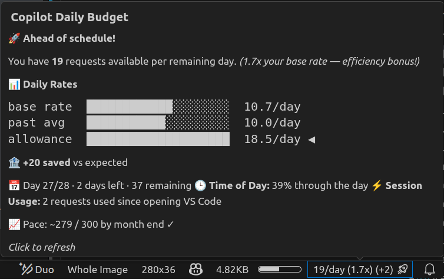

# Copilot Tracer

<p align="center">
  
</p>

NOTE: This extension was mainly vibe-coded. Thus, not every line of code may be perfectly clean or follow best practices.


**Track your GitHub Copilot premium request usage directly in the VS Code status bar.**

Copilot Tracer monitors how many premium requests you've used this month, calculates your daily budget, and shows a live pacing bar — so you never blow through your quota without realizing it.

Supports **Individual**, **Business**, and **Enterprise** plans with zero configuration.

Short overview always visible in the status bar, with a rich tooltip for deep insights. Works out of the box using your existing GitHub sign-in in VS Code, or optionally via a Personal Access Token.

<p align="center">
  
</p>

When hovering over the status bar item, you'll see a detailed daily budget report with ASCII bar charts comparing your base rate, average usage, and current allowance — plus insights on how you're pacing against your monthly limit.

<p align="center">
  
</p>


---

## Features

- **Daily budget pacing** — see exactly how many premium requests you can use per remaining day
- **Live status bar** — always-visible daily allowance (`20/day`) with a multiplier when you're ahead or behind
- **Rich tooltip** — hover for a full daily budget report with ASCII bar charts comparing your base rate, average usage, and current allowance
- **Session counter** — tracks how many requests you've used since opening VS Code (`+12`)
- **Color-coded status** — green when on track, yellow when over budget, red when exhausted
- **Auto-refresh** — updates every 30 minutes (configurable) with smart rate-limit handling
- **Zero config** — works out of the box using your existing VS Code GitHub sign-in
- **PAT fallback** — optional Personal Access Token path for advanced setups
- **Diagnostics command** — built-in troubleshooting to verify API access

## Status Bar States

| State | Appearance | Description |
|-------|-----------|-------------|
| On track | `$(github-copilot) 20/day` | You're pacing well within your budget |
| Ahead | `$(github-copilot) 25/day (1.9x) 🚀` | You've banked extra requests — spend freely |
| Over budget | `$(github-copilot) 8/day (0.6x) 🔥` | Slow down — you're running hot this month |
| Exhausted | `$(github-copilot) 0/day` | Monthly limit reached (red background) |
| Session usage | `$(github-copilot) 20/day (+12)` | 12 requests used this VS Code session |

## Tooltip — Daily Budget Report

Hover over the status bar item for a detailed breakdown:

```
┌──────────────────────────────────────────────┐
│  Copilot Daily Budget                        │
│                                              │
│  ✅ On track                                 │
│                                              │
│  You have 20 requests available per          │
│  remaining day.                              │
│                                              │
│  📊 Daily Rates                              │
│                                              │
│  base rate  ████████████░░░░░░░░  9.7/day    │
│  past avg   █████████░░░░░░░░░░░  7.2/day    │
│  allowance  ████████████████████  16.1/day ◀ │
│                                              │
│  🏦 +42 saved vs expected                    │
│                                              │
│  📅 Day 15/28 · 14 days left · 225 remaining │
│  🕒 Time of Day: 45% through the day         │
│  ⚡ Session Usage: 12 requests since opening  │
│                                              │
│  📈 Pace: ~215 / 300 by month end ✓          │
│                                              │
│  Click to refresh                            │
└──────────────────────────────────────────────┘
```

## Connect GitHub Account

When no session is detected, the extension shows a one-click connect prompt.

## Diagnostics Output

Run **Copilot Tracer: Diagnose API Access** to see raw API results.

## How It Works

### Authentication — Two Paths

Copilot Tracer uses a **two-tier authentication strategy**:

#### 1. VS Code GitHub Session (Primary — Zero Config)

The extension silently reads your **existing** VS Code GitHub sign-in — the same session used by GitHub Copilot, Settings Sync, or any other GitHub-connected extension. No extra login, no PAT, no configuration.

```
VS Code GitHub Auth Session
        │
        ▼
┌─────────────────────────────┐
│ GitHub Internal Copilot API │  ◀─ Same API that Copilot itself uses
│  /copilot_internal/v2/token │
└──────────┬──────────────────┘
           │ (returns quota data)
           ▼
   ┌───────────────┐
   │  Quota Found? │
   │   YES → done  │
   │   NO  → try   │
   │   Business EP │
   └───────┬───────┘
           ▼
┌──────────────────────────┐
│  /copilot_internal/user  │  ◀─ Business/Enterprise endpoint
│  (quota_snapshots)       │
└──────────────────────────┘
```

The extension **never triggers a login prompt** on this path — it only reads sessions that already exist. If you're signed in to GitHub in VS Code (check the Accounts icon in the bottom-left), it just works.

#### 2. Personal Access Token — PAT (Fallback)

If no VS Code session is available (e.g., remote containers, restricted environments), you can manually provide a GitHub PAT:

| Plan | Required PAT Scope |
|------|-------------------|
| Individual | `read:billing` (or fine-grained with billing-read) |
| Business | `read:org` or `manage_billing:copilot` |

The PAT is stored securely in VS Code's **SecretStorage** (OS keychain-backed) and is never logged or transmitted anywhere except to `api.github.com`.

### Plan Detection

| Plan | API Endpoint | How It Works |
|------|-------------|--------------|
| **Individual** | `GET /copilot_internal/v2/token` | Reads `limited_user_quotas.copilot_premium_interaction.storage` for used/remaining/quota |
| **Business** | `GET /copilot_internal/user` | Reads `quota_snapshots.premium_interactions` for entitlement/remaining |
| **Enterprise** | Same as Business | Enterprise plans use the same Business endpoint |
| **PAT — Individual** | `GET /users/{user}/settings/billing/usage/summary` | Filters `usageItems` for the `copilot_premium_request` SKU |
| **PAT — Business** | `GET /orgs/{org}/settings/billing/usage/summary` | Same SKU filter at the organization level |

When `planType` is set to `auto` (default), the extension tries Individual first, then falls back to Business if the Individual endpoint returns no quota data.

### GitHub APIs Used

The extension calls these GitHub API endpoints:

| Endpoint | Auth | Purpose |
|----------|------|---------|
| `GET /copilot_internal/v2/token` | OAuth token | Primary: fetch quota for Individual plans |
| `GET /copilot_internal/user` | OAuth token | Primary: fetch quota for Business/Enterprise plans |
| `GET /user` | PAT | Resolve authenticated username (PAT fallback) |
| `GET /users/{user}/settings/billing/usage/summary` | PAT | Personal billing usage (PAT fallback) |
| `GET /orgs/{org}/settings/billing/usage/summary` | PAT | Org billing usage (PAT fallback) |
| `GET /orgs/{org}/copilot/billing/seats` | PAT | Copilot seat info for diagnostics |
| `GET /user/orgs` | PAT | Auto-detect org membership (PAT fallback) |

All requests use API version `2022-11-28` and go to `https://api.github.com`.

### Pacing Calculation

The daily pacing engine calculates:

- **Base daily budget** = `monthlyLimit / daysInMonth`
- **Daily allowance** = `remaining / daysRemaining` (the hero number shown in the status bar)
- **Multiplier** = `dailyAllowance / baseDailyBudget` — above 1.0 means you have headroom, below 1.0 means pressure
- **Banked** = `expectedByNow - usedRequests` — positive means you've saved requests, negative means overspent
- **Projected end** = extrapolates your average daily usage to month end

The calculation accounts for **time of day** so numbers update smoothly throughout the day rather than jumping at midnight.

## Private (Individual) Accounts

For personal GitHub Copilot subscriptions:

1. **Sign in to GitHub in VS Code** — use the Accounts icon (bottom-left) or any GitHub extension
2. The extension automatically detects your session and fetches quota from the Copilot internal API
3. No further configuration needed — your monthly limit is read directly from the API

If using a PAT instead:
1. Run **Copilot Tracer: Set GitHub Token**
2. Enter a PAT with `read:billing` scope
3. Your username is auto-detected on first run

## Business / Enterprise Accounts

For organization-managed Copilot seats:

1. **Sign in to GitHub in VS Code** — the extension detects Business plans automatically via the `/copilot_internal/user` endpoint
2. Quota, remaining requests, and reset dates are all read from the API
3. No org name or plan type configuration needed

If using a PAT instead:
1. Run **Copilot Tracer: Set GitHub Token** with a PAT that has `read:org` scope
2. Set `copilot-tracer.orgName` to your organization's GitHub login (e.g., `my-company`)
3. Set `copilot-tracer.planType` to `business`
4. The extension queries the org-level billing API

> **Note:** The PAT path for Business plans requires you to be an **org owner** or **billing manager** to access org-level billing data. The primary VS Code auth path works for all org members.

## Installation

### From Source

```bash
git clone https://github.com/your-username/copilot-tracer.git
cd copilot-tracer
npm install
npm run compile
```

Then press **F5** in VS Code to launch the Extension Development Host.

### Package as VSIX

```bash
npm run package
```

Install the generated `.vsix` file via **Extensions → ⋯ → Install from VSIX…**

## Commands

| Command | Description |
|---------|-------------|
| **Copilot Tracer: Connect GitHub Account** | One-time GitHub sign-in (triggers OAuth flow) |
| **Copilot Tracer: Set GitHub Token** | Manually enter a PAT for the fallback path |
| **Copilot Tracer: Clear GitHub Token** | Remove the stored PAT from SecretStorage |
| **Copilot Tracer: Refresh Usage** | Force an immediate data refresh (bypasses cache) |
| **Copilot Tracer: Show Usage Details** | Refresh and hint to hover the status bar |
| **Copilot Tracer: Diagnose API Access** | Run full API diagnostics and print results to the Output panel |

## Configuration

All settings are under the `copilot-tracer` namespace in VS Code settings:

| Setting | Type | Default | Description |
|---------|------|---------|-------------|
| `copilot-tracer.monthlyLimit` | number | `300` | Your monthly premium request limit. Overridden automatically when the API reports the actual quota. |
| `copilot-tracer.username` | string | `""` | GitHub username. Auto-detected on first run when using a PAT. |
| `copilot-tracer.orgName` | string | `""` | GitHub organization name. Required for Business/Enterprise plans when using a PAT. Leave empty for Individual plans or when using VS Code auth. |
| `copilot-tracer.planType` | `auto` \| `individual` \| `business` | `auto` | Subscription plan type. `auto` tries Individual first, falls back to Business. Only relevant for the PAT path. |
| `copilot-tracer.refreshIntervalMinutes` | number | `30` | Auto-refresh interval in minutes (5–120). |
| `copilot-tracer.showInStatusBar` | boolean | `true` | Show/hide the status bar item. |

## Rate Limiting

The extension handles GitHub API rate limits gracefully:

- Caches quota data for at least **5 minutes** between API calls
- Delays the initial API call by **10 seconds** after activation to avoid startup congestion
- When rate-limited (HTTP 429), backs off automatically and retries after the `Retry-After` period
- Shows a clock icon with retry information in the status bar during cooldowns

## Error Handling

| Scenario | Behavior |
|----------|----------|
| **Token expired (401)** | Clears stored token, prompts for a new one |
| **Insufficient scopes (403)** | Shows which scopes are needed for your plan |
| **User not found (404)** | Clears cached username, re-resolves, retries |
| **Rate limited (429)** | Backs off, shows countdown, auto-retries |
| **No GitHub session** | Shows "Connect GitHub Account" button |
| **Network error** | Displays error with retry option |

## Session Notifications

Every **10 requests** used in the current VS Code session, a notification pops up to keep you aware of your spending rate. The session counter resets when you close VS Code.

## Architecture

```
src/
├── extension.ts   — Entry point: activation, commands, refresh orchestration
├── api.ts         — GitHub API calls (internal + billing endpoints)
├── pacing.ts      — Daily budget calculation engine
├── settings.ts    — Settings resolution, token storage, username detection
├── statusBar.ts   — Status bar rendering (text, tooltip, colors)
└── types.ts       — Shared TypeScript interfaces
```

### Data Flow

```
Activation (10s delay)
        │
        ▼
   ┌─────────┐     VS Code Auth     ┌──────────────────────┐
   │ refresh()├────────────────────►│ tryGetQuotaFromVSCode │
   │         │                      │  Auth()               │
   │         │◄─── quota found ─────┤                       │
   │         │                      └──────────────────────┘
   │         │
   │         │     PAT Fallback      ┌──────────────────────┐
   │         ├─── (no session) ────►│ resolveSettings()     │
   │         │                      │ resolveUsage()        │
   │         │◄─── usage data ──────┤                       │
   └────┬────┘                      └──────────────────────┘
        │
        ▼
  calculatePacing()  →  showPacing()  →  Status Bar
```

## Troubleshooting

1. **"Not connected" in status bar** — Click the status bar item to sign in to GitHub, or use the Accounts menu (bottom-left in VS Code)
2. **Shows 0 usage but you've been using Copilot** — Your plan may be Business/Enterprise; the extension should detect this automatically, but you can set `planType` to `business` and provide your `orgName`
3. **Rate limit errors** — Wait a few minutes; the extension auto-retries. Avoid setting the refresh interval below 5 minutes
4. **Run diagnostics** — Use **Copilot Tracer: Diagnose API Access** from the Command Palette to see raw API responses in the Output panel

## Requirements

- **VS Code** 1.90.0 or later
- **GitHub Copilot** subscription (Individual, Business, or Enterprise)
- Signed in to GitHub in VS Code (recommended) or a GitHub PAT

## License

[MIT](LICENSE)
